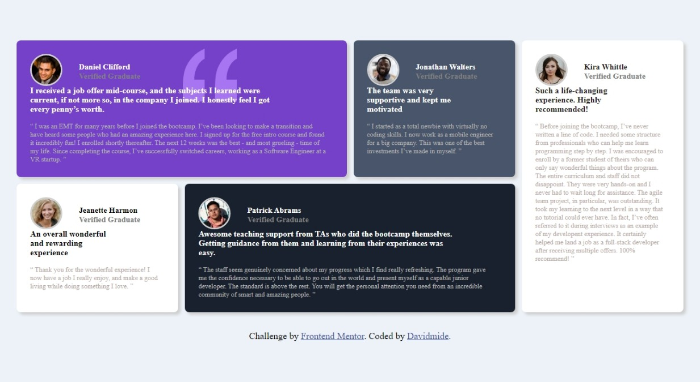
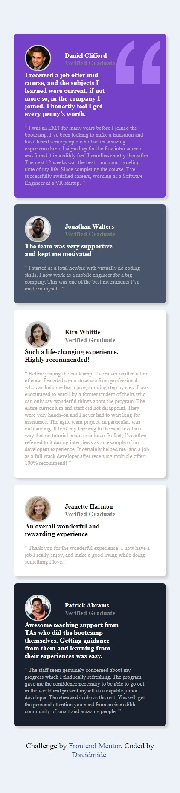

# Frontend Mentor - Testimonials grid section solution

This is a solution to the [Testimonials grid section challenge on Frontend Mentor](https://www.frontendmentor.io/challenges/testimonials-grid-section-Nnw6J7Un7). Frontend Mentor challenges help you improve your coding skills by building realistic projects. 

## Table of contents

- [Overview](#overview)
  - [The challenge](#the-challenge)
  - [Links](#links)
- [My process](#my-process)
  - [Built with](#built-with)
  - [What I learned](#what-i-learned)
  - [Useful resources](#useful-resources)
- [Author](#author)
- [Acknowledgments](#acknowledgments)

## Overview
The challenge is to build a layout using grid 

### The challenge

Users should be able to:

- View the optimal layout for the site depending on their device's screen size

### Screenshot

### Links

- Solution URL: [Add solution URL here](https://davidmide02/testimonials-grid-section-main/)
- Live Site URL: [Add live site URL here](https://davidmide02.github.io/testimonials-grid-section-main/)

## My process
-Analyized the Layout
-Set the html and
-The css 

### Built with

- Semantic HTML5 markup
- CSS custom properties
- Flexbox
- CSS Grid
- Desktop-first workflow

### What I learned

I learnt how to use grid and grid properties and a different way of approching designns

### Useful resources

- [Example resource 1](https://www.Youtube.com) - This guides me during the coding. I really liked this pattern and will use it going forward.
- [Example resource 2](https://www.W3school.com) - This is an amazing article which helped me finally understand media query. I'd recommend it to anyone still learning this concept.

## Author

- Frontend Mentor - [@yourusername](https://www.frontendmentor.io/profile/Davimide02)
- Twitter - [@Davidmide02](https://www.twitter.com/Davidmide02)
